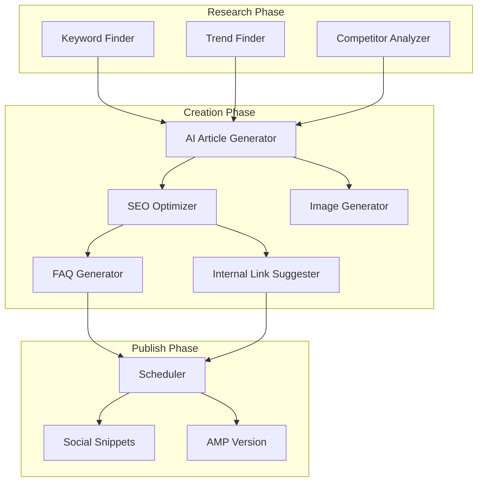

# Akelapan.com – Expanded Project Plan

This plan expands your original PLAN.md with additional ideas across content, automation, monetization, UX, and growth.

---

## 1. Extended Content Types & Sections

### 1.1 New Content Formats

| Type                   | Description                     | SEO Value             |
| ---------------------- | ------------------------------- | --------------------- |
| **Short Stories**      | 500–800 word emotional fiction  | Long dwell time       |
| **Poetry**             | Hindi poems on loneliness, hope | Shareable, viral      |
| **Day-in-Life**        | First-person narratives         | Relatable, engaging   |
| **Before/After**       | Recovery journey stories        | Trust building        |
| **Letter to Self**     | Self-reflection format          | Emotional connection  |
| **Q&A Columns**        | "Ask Akelapan" advice column    | User-generated topics |
| **Guided Meditations** | Text + audio scripts            | Unique content        |
| **Journal Prompts**    | Daily reflection questions      | Repeat visits         |

### 1.2 New Website Sections

- **Crisis Resources** – Helpline numbers, emergency support (trust + SEO)
- **Glossary** – Mental health terms in Hindi (featured snippets)
- **Timeline / Milestones** – "30 Days to Feel Better" type series
- **Community Spotlights** – Curated user stories (with consent)
- **Expert Corner** – Guest posts from counselors (E-E-A-T)
- **Newsletter Archive** – Past editions as articles
- **Podcast Transcripts** – If you add audio later

---

## 2. Enhanced AI Automation System

### 2.1 Extended Automation Flow



### 2.2 New Automation Ideas

- **Trend Finder** – Scrape Google Trends, Reddit, Quora for trending loneliness/breakup topics
- **Seasonal Calendar** – Auto-generate Valentine's, Diwali, New Year themed content
- **Evergreen Refresher** – AI re-optimizes old articles every 6 months
- **FAQ Generator** – Auto-extract FAQs from article, add schema markup
- **Internal Link Bot** – Suggests 3–5 internal links per article
- **Social Snippet Generator** – Auto-creates Twitter/FB/WhatsApp share text
- **Multi-format Export** – Same article as blog, carousel, thread, email

### 2.3 Content Batching Strategy

- **Morning batch** (6–8 AM): 5 motivation/quote articles
- **Afternoon batch** (12–2 PM): 5 advice/how-to articles
- **Evening batch** (6–8 PM): 5 stories/emotional content
- Mimics when users search (loneliness peaks at night)

---

## 3. Advanced SEO & Technical SEO

### 3.1 Schema Markup Types

- `Article` – All blog posts
- `FAQPage` – FAQ sections
- `HowTo` – Step-by-step guides
- `BreadcrumbList` – Navigation
- `Organization` – Site-wide
- `WebPage` – Category pages
- `Person` – Author/E-E-A-T (if you add bylines)

### 3.2 Additional SEO Features

- **Hindi + Hinglish variants** – Same topic, two articles (broader reach)
- **Voice search optimization** – Question-based H2s ("कैसे करें?")
- **Featured snippet targeting** – Lists, tables, definitions
- **Image SEO** – Alt text in Hindi, descriptive filenames
- **Core Web Vitals** – LCP, FID, CLS optimization from day one
- **Sitemap** – Auto-generated, submitted to Search Console
- **RSS feed** – For syndication and email

### 3.3 Internal Linking Strategy

- **Hub pages** – "Loneliness Guide" linking to 20+ articles
- **Topic clusters** – 1 pillar + 5–10 cluster articles

---

## 4. Monetization Expansion

### 4.1 Additional Revenue Streams

- **Sponsored posts** – Mental health apps, therapy platforms (clear disclosure)
- **Newsletter sponsors** – If you hit 5k+ subscribers
- **Premium membership** – Ad-free + exclusive content (₹99/month)
- **Consultation booking** – Affiliate for BetterHelp, Manas, etc.
- **Merchandise** – "Akelapan survivor" mugs, journals
- **Course/Workshop** – "30 Days Loneliness Recovery" paid course

### 4.2 Ad Placement Ideas

- Sticky footer ad (mobile)
- In-content native ads (every 3rd paragraph)
- Exit-intent popup (soft, non-intrusive)
- Category page leaderboard
- Between "Related Articles"

### 4.3 Affiliate Niches to Add

- Online therapy (BetterHelp, Manas)
- Meditation (Headspace, Calm)
- Journaling apps (Day One, Journey)
- Sleep apps
- Self-help book bundles (Amazon)
- Relationship counseling services

---

## 5. Admin Panel Enhancements

### 5.1 Additional Admin Features

- **Content calendar view** – Visual scheduling
- **Bulk operations** – Publish/unpublish multiple
- **Analytics dashboard** – Page views, top articles, traffic sources
- **A/B title testing** – Test 2 titles, track CTR
- **Comment moderation** – If you add comments
- **User feedback collection** – "Was this helpful?" per article
- **API usage monitor** – OpenAI/Gemini cost tracking
- **Backup/restore** – Database backups

### 5.2 Automation Controls

- Pause/resume auto-publish
- Set daily article limit (5/10/20)
- Category priority (which categories get more articles)
- Keyword blacklist (avoid sensitive topics)
- Quality threshold (reject AI output below X score)

---

## 6. User Engagement Features

### 6.1 Engagement Mechanics

- **"Was this helpful?"** – Thumbs up/down (signals for SEO)
- **Reading progress bar** – Increases time on page
- **Related articles** – 3–5 at bottom (internal links)
- **"Save for later"** – LocalStorage or account
- **Share buttons** – WhatsApp, Twitter, Copy link
- **Print-friendly version** – PDF export
- **Dark mode** – Comfort for night readers

### 6.2 Personalization (Phase 2)

- **"Articles for you"** – Based on read history
- **Category preferences** – Show preferred categories first
- **Reading level** – Simple vs detailed toggle

---

## 7. Technical Enhancements

### 7.1 Performance

- **ISR (Incremental Static Regeneration)** – Next.js for fast pages
- **Image optimization** – Next/Image, WebP, lazy load
- **Edge caching** – Vercel Edge for global speed
- **Database connection pooling** – Supabase best practices

### 7.2 Security & Compliance

- **Rate limiting** – Prevent API abuse
- **CORS** – Strict origin policy
- **Crisis content disclaimer** – "Not a substitute for professional help"
- **Cookie consent** – For EU/global compliance
- **Privacy policy** – Required for AdSense

### 7.3 Monitoring

- **Error tracking** – Sentry or similar
- **Uptime monitoring** – UptimeRobot
- **Search Console** – Indexing status
- **Analytics** – GA4 + custom events

---

## 8. Content Calendar Ideas (Sample)

| Month | Themes                | Article Ideas                                      |
| ----- | --------------------- | -------------------------------------------------- |
| Jan   | New Year, Fresh Start | Resolutions, Letting go, New beginnings            |
| Feb   | Valentine's, Love     | Single on Valentine's, Self-love, Breakup recovery |
| Mar   | Exam stress           | Student loneliness, Pressure, Coping               |
| Apr   | Summer, Change        | Seasonal depression, New routines                  |
| May   | Mother's Day          | Family dynamics, Missing someone                   |
| Jun   | Pride, Identity       | Self-acceptance, Belonging                         |
| Jul   | Monsoon               | Mood and weather, Cozy loneliness                  |
| Aug   | Independence Day      | Freedom from toxic relationships                   |
| Sep   | Festive prep          | Festival loneliness, Family expectations           |
| Oct   | Mental Health Day     | Stigma, Seeking help                               |
| Nov   | Diwali                | Festival blues, Family pressure                    |
| Dec   | Year-end              | Reflection, Gratitude, Year review                 |

---

## 9. Growth & Marketing Ideas

### 9.1 Organic Growth

- **Pinterest** – Visual quotes, infographics (huge for emotional content)
- **Instagram** – Reels with article snippets, carousels
- **YouTube Shorts** – Article summaries, 60-sec advice
- **Quora** – Answer loneliness questions, link to articles
- **Reddit** – r/India, r/lonely (value-first, no spam)
- **WhatsApp status** – Shareable quote images

### 9.2 Community Building

- **Telegram group** – Daily motivation, support
- **Discord** – Anonymous support community
- **Newsletter** – Weekly digest, exclusive content

### 9.3 Partnerships

- **Mental health NGOs** – Content collaboration
- **College counselors** – Resource sharing
- **Influencers** – Micro-influencers in wellness space

---

## 10. Database Schema Extensions

### 10.1 Additional Tables

```sql
-- categories (extend)
parent_id, icon, color, sort_order

-- tags
id, name, slug, article_count

-- newsletter_subscribers
id, email, subscribed_at, preferences

-- article_analytics
article_id, date, views, shares, helpful_yes, helpful_no

-- automation_logs
id, type, status, details, created_at

-- ai_usage
id, provider, tokens_used, cost, created_at
```

---

## 11. Phase-wise Implementation Suggestion

### Phase 1 (Months 1–2): Foundation

- Next.js + Supabase setup
- Basic article CRUD
- 5 categories, 50 manual/AI articles
- Home, Articles, Category pages
- Admin login + article management

### Phase 2 (Months 3–4): Automation

- AI article generator
- Keyword finder
- Auto-publish script
- Image generation
- Target: 200 articles

### Phase 3 (Months 5–6): Monetization & Scale

- AdSense integration
- Affiliate links
- 500+ articles
- Newsletter signup
- Analytics dashboard

### Phase 4 (Months 7+): Growth

- User stories section
- Quiz/assessment
- Community features
- Premium tier (optional)
- Target: 1000 articles

---

## 12. Success Metrics to Track

- **Content**: Articles published, words/day, categories covered
- **Traffic**: Sessions, page views, bounce rate, time on page
- **SEO**: Indexed pages, avg position, impressions, CTR
- **Engagement**: Shares, newsletter signups, "helpful" votes
- **Revenue**: Ad RPM, affiliate clicks, conversion
- **Technical**: Core Web Vitals, error rate, uptime

---

## 13. Risk Mitigation

- **AI content detection** – Add human review for top 10% traffic articles
- **AdSense rejection** – Ensure quality, original structure, no thin content
- **Sensitive topics** – Crisis disclaimer, avoid self-harm triggers
- **Hindi font rendering** – Test Noto Sans Devanagari, ensure readability
- **API costs** – Set daily limits, use cheaper models for drafts

---

## Summary: New Ideas Count

| Category         | New Ideas Added           |
| ---------------- | ------------------------- |
| Content types    | 8 new formats             |
| Website sections | 7 new sections            |
| Automation       | 7 new automation features |
| SEO              | 10+ enhancements          |
| Monetization     | 6 new revenue streams     |
| Admin            | 10+ new features          |
| Engagement       | 8 user features           |
| Growth           | 10+ marketing tactics     |

Your original plan is solid. This expansion adds depth across content, automation, monetization, and growth—prioritize based on your timeline and resources.
