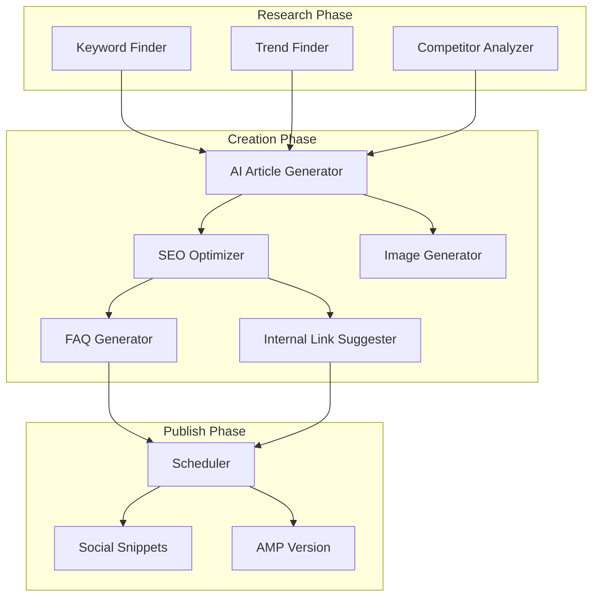

# Step 7: AI Automation System

## Automation Flow

```
Keyword Finder
    ↓
AI Article Generator
    ↓
SEO Optimizer
    ↓
Image Generator
    ↓
Auto Publish
```

## Extended Automation Flow



## New Automation Ideas

- **Trend Finder** – Scrape Google Trends, Reddit, Quora for trending topics
- **Seasonal Calendar** – Auto-generate Valentine's, Diwali, New Year themed content
- **Evergreen Refresher** – AI re-optimizes old articles every 6 months
- **FAQ Generator** – Auto-extract FAQs from article, add schema markup
- **Internal Link Bot** – Suggests 3–5 internal links per article
- **Social Snippet Generator** – Auto-creates Twitter/FB/WhatsApp share text
- **Multi-format Export** – Same article as blog, carousel, thread, email

## AI Article Prompt Template

Write a detailed SEO optimized article about: **[TOPIC]**

Article must include:

- emotional tone
- practical advice
- real life relatable examples
- structured headings

Target word count: 1500+ words.

Audience: People feeling lonely or emotionally distressed.

Language: Hindi.

## Image Generation

Each article will have:

- AI generated featured image
- Optional inline images

Images should represent: loneliness, thinking, sadness, hope, self reflection

---

**Next:** [08-Admin-Panel.md](08-Admin-Panel.md)
